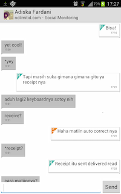

# Rumpy Client for Android
Rumpy is a chat service that I developed back in 2012 for hobby project when I am still learning to program at the first time. The client is part of a stack consist of:
- Client app for Android.
- [Server](https://www.github.com/bagasabisena/RumpyServerWS), built in Java on top of WebSocket using excellent networking library [Netty Framework](http://www.netty.io).
- JSON-based [protocol](https://www.github.com/bagasabisena/Stanza).

The client uses [Autobahn](https://github.com/tavendo/AutobahnAndroid) WebSocket library and also [ActionbarSherlock](https://github.com/JakeWharton/ActionBarSherlock) to provide actionbar.

Below are the screenshots of the app

  |  |     
:-----------------:|:----------------------:|----------------------

